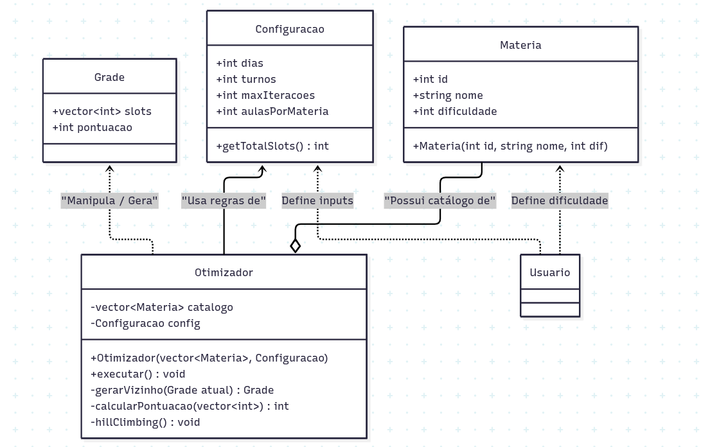

# Otimização de Horários de Estudo (Hill Climbing)

Este projeto é uma implementação em **C++ Orientado a Objetos** de um sistema para organização automática de grades de horários. 

O objetivo é utilizar o algoritmo de busca local **Hill Climbing** (Subida de Encosta) com a estratégia de Reinícios Aleatórios para encontrar a distribuição de aulas que maximize a produtividade do estudante e minimize o cansaço mental, baseando-se em preferências personalizadas.

## 🧠 Heurística (Regras de Pontuação)

A pontuação não é fixa; ela se adapta ao nível de dificuldade (0 a 3) que o usuário define para cada matéria. O algoritmo avalia a qualidade da grade com base nos seguintes critérios:

1.  **Produtividade Matinal (+20):** Prioriza matérias de alta dificuldade (ex: Matemática, Física) no turno da manhã.
2.  **Preservação Noturna (-20 / +10):** Penaliza matérias difíceis à noite e bonifica tempo livre para descanso.
3.  **Variedade (-50):** Aplica penalidade severa caso a mesma disciplina se repita consecutivamente no mesmo dia (evita fadiga).

## 📂 Estrutura do Projeto

O código original foi refatorado para seguir padrões de Orientação a Objetos:




*   **`Configuracao`**: Substitui as antigas constantes globais. Armazena as regras do "universo" definidas pelo usuário no menu inicial: quantidade de dias, turnos por dia e o número máximo de iterações do algoritmo.
*   **`Grade`**: Representa um estado candidato da solução (o vetor de slots de tempo). É responsável por calcular seu próprio score (pontuação) consultando a dificuldade das matérias alocadas.
*   **`Otimizador`**:  O "motor" do sistema. Recebe a Configuracao e o Catálogo de Matérias. Implementa o Hill Climbing e gerencia os Random Restarts (executa o algoritmo várias vezes para escapar de máximos locais).
*   **`Materia`**: Classe que representa a disciplina. Além do ID e Nome, agora armazena a Dificuldade Personalizada (0-3), permitindo que o algoritmo trate a mesma matéria de forma diferente para usuários diferentes.

## 🚀 Como Compilar e Executar

Certifique-se de ter o docker instalado. No terminal, execute:

```bash
docker-compose run --rm otimizador
```